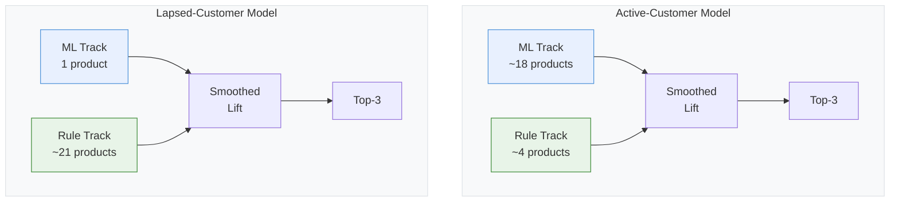

## Technical Stack

| Layer | Technology |
|-------|-----------|
| Data Platform | Databricks, Delta Lake |
| Feature Engineering | Spark SQL (shared schema with active-customer model) |
| Clustering | K-Means + Decision Tree Surrogate |
| ML Model | PySpark MLlib LR + SparkXGBRegressor (single product) |
| Rule Models | Persona-code conversion rate lookup (Spark-native) |
| Calibration | Smoothed Lift ($\alpha = 0.01$) |
| Inference | Spark-native (broadcast joins, no UDFs) |
| AI Workflow | Gemini (architecture adaptation) + Claude Code (pipeline generation) |

## Context

This post is a companion to the [[Projects/Machine Learning Modelling/persona_based_recommendation|existing-customer product recommendation model]]. Both use the same architecture — persona-based clustering, two-stage ML/Rule hybrid scoring, smoothed lift calibration — but target fundamentally different populations. The existing-customer model targets active policyholders ($\geq 1$ active contract). This model targets **lapsed customers**: those with zero active contracts who have lapsed or terminated their policies.

The distinction is material. These customers have no current portfolio to cross-sell against. Their value distribution skews heavily toward the lowest tier. And the population is roughly an order of magnitude smaller.

## What Changes for Lapsed Customers

> [!important] Key Structural Difference
> The active-customer model trains ML ensembles for multiple product groups. The lapsed-customer model has sufficient data for **only one** ML model — everything else falls to the persona-based rule track. This inversion makes the persona system's quality the dominant driver of overall performance.

### Collapse of the ML Track

The active-customer model trains two-stage ML ensembles for multiple product groups exceeding the positive-sample threshold. The lapsed-customer model has sufficient positive samples for only **one** product category. All remaining product groups fall to the rule-based track — persona-code conversion rate lookups.

This inversion makes persona quality the dominant factor in model performance. The majority of the system's discrimination comes from how well the four-dimensional persona codes capture product affinity.

### Shifted Value Distribution

The value dimension uses the same 6-factor scoring framework:

$$
\text{ValueScore}_i = \sum_{k=1}^{6} \mathbb{1}\big[x_{i,k} \geq \tau_k\big]
$$

But the thresholds are recalculated on the lapsed population. With zero active contracts, the first condition (active contract count) is trivially failed by everyone. The remaining conditions — premium history, product diversity, tenure, cumulative premium — separate customers who maintained substantial portfolios before lapsing from those who were single-product, short-tenure holders.

> **Margin note:**
> This is a survivor bias in reverse: the lapsed population is non-randomly selected from the full customer base. The value distribution among lapsed customers reveals who *leaves*, not who *stays* — and the two groups have fundamentally different feature profiles.

The distribution shifts accordingly: the highest value tier shrinks dramatically compared to the active-customer population, while the lowest tier expands. This reflects a selection effect — customers with deep product portfolios rarely let everything lapse. Those who do are disproportionately single-product holders.

### Adapted Clustering

K-Means is re-fitted on the lapsed population ($K$ selected via silhouette analysis). The cluster profiles differ structurally from the active-customer model. The dominant persona codes have elevated rates of unknown occupation classification (a substantial share in the occupation dimension), reflecting incomplete data on customers who have been out of the active system.

## Feature Engineering

The feature engineering pipeline shares the SQL schema with the active-customer model but produces different distributional characteristics. The same 10-step preprocessing pipeline applies:

1. Column deletion (campaign metadata, sales leakage, near-zero-variance features)
2. Time-based split (most recent campaign month for test)
3. Log-transformation of premium and amount features
4. 99th-percentile clipping on count features
5. Recency processing (sentinel replacement + 120-month cap + binary "never purchased" flags)
6. Age validity flagging and median imputation
7. Robust scaling of tenure and ratio features
8. One-hot encoding of gender, regional tier, occupational risk grade
9. Target encoding of high-cardinality fields ($\alpha = 100$, train-only)
10. Validation checks (split distribution, null removal, type casting)

## The Single ML Model

Only one product category has sufficient signal for a two-stage ensemble:

$$
\hat{p}_{\text{final}} = \text{clip}\!\Big(\hat{p}_{\text{LR}} + f_{\text{XGB}}(\mathbf{x};\, y - \hat{p}_{\text{LR}}),\; 0,\; 1\Big)
$$

Same architecture as the active-customer model: logistic regression base ($\ell_2$ regularization, class-weighted) plus XGBoost residual correction (shallow trees, conservative learning rate).

This single ML model achieved notably higher discrimination than any individual product model in the active-customer system — with minimal train-to-test degradation. The signal is strong and clean: customers who lapsed but still require this particular coverage form a distinct, identifiable subpopulation.

## Rule Track: Remaining Products

The rule track operates identically to the active-customer model: for each product and persona code, look up the training-set conversion rate. Unseen persona codes fall back to the global base rate.

The limitation surfaces in calibration. With only persona-level conversion rates and no ML refinement, the rule track cannot capture within-persona variation for individual products. This is an inherent ceiling of the persona-based approach when training data is insufficient for discriminative modeling.

## Post-Processing and Ranking

Same three business rules:

1. **Recent churn filter** — lapse within a recent window $\to$ all scores zeroed
2. **Product overlap penalty** — existing coverage $\to$ discount multiplier
3. **Recent purchase filter** — products purchased within a recent holding period $\to$ zeroed

Smoothed lift calibration:

$$
\text{LiftScore}_{i,k} = \frac{\text{Score}_{i,k}}{\bar{y}_k + 0.01}
$$

Top-3 selection per customer by lift score.

## What the Comparison Reveals

Building the same architecture for two populations exposes where persona-based recommendation performs well and where it reaches its limits:

**Strong performance setting.** When the population is relatively homogeneous and purchases concentrate in a few product categories. Lapsed customers cluster tightly around 2–3 product categories — the model concentrates signal effectively. The single ML model captures the dominant product; the persona rules handle the remainder adequately.

**Weaker performance setting.** When the population is diverse and purchases spread across many products. The active-customer model's product distribution is flatter, and the rule track cannot differentiate within persona codes for low-frequency products.

**Architectural implication.** The ML/Rule split threshold should arguably be population-dependent. For a smaller population, the threshold represents a meaningful fraction of the data. For a larger population, the same threshold is a tiny fraction, potentially leaving products with many positives on the rule track that might benefit from discriminative modeling (perhaps with stronger regularization or a simpler model family than the full two-stage ensemble).

