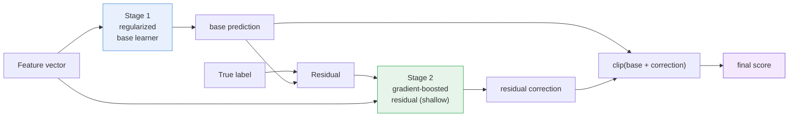
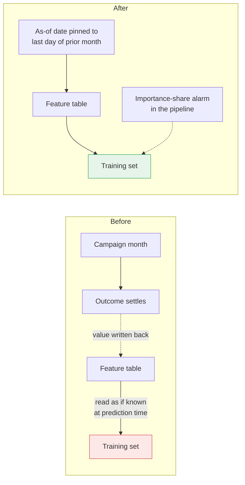
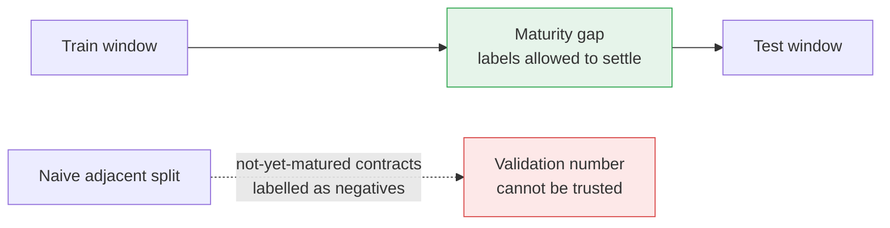
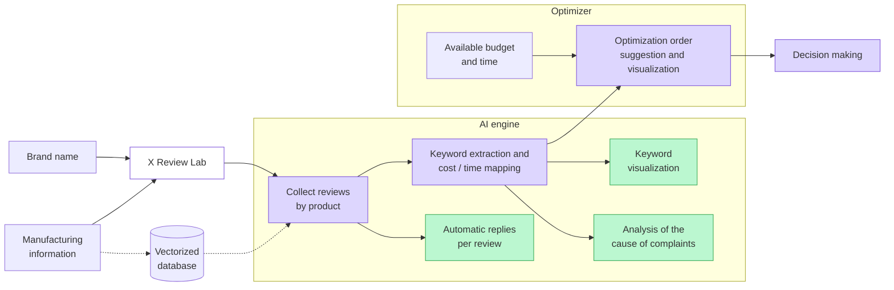
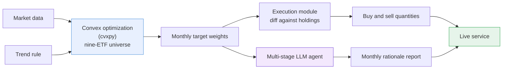

I am a data scientist. I build hybrid models that pair a statistical base learner with a
gradient-boosted residual, and I validate them on time-based holdouts rather than random
splits.

This page collects three things: the five prediction and causal-inference models I delivered
end to end at a leading global insurance company, the two things I designed and built alone,
and what nearly went wrong in the modelling work and how I caught it. Every claim below links
to something you can open yourself.

**One registered patent as sole inventor. Two first-author IEEE Access papers, one published
and one under review. One live service. Five delivered models.**

- Resume and contact: [LinkedIn](https://www.linkedin.com/in/ji-heon-jay-park-89a1a1203/)
- Design write-ups for the five models: the five engineering posts on this site
- Code: [github.com/JHJP/xreviewlab](https://github.com/JHJP/xreviewlab)

---

## 1. Five prediction and causal-inference models

**Sep 2025 to Feb 2026. On-site data scientist at a leading global insurance company.
Problem definition through deployment specification.**
Azure Databricks and Delta Lake, PySpark and Spark SQL over multi-table joins with strict
temporal lag, PySpark MLlib and XGBoost, MLflow, time-based out-of-sample validation.

> [!important] What is not on this page
> Client raw data and deliverables are not mine to release, so none of it is here. What
> follows is the method, and results measured on holdout windows the models never saw during
> training. The full design reasoning for all five is published in the engineering posts on
> this site.

All five ran the same way: define the prediction target and the population with the client,
interview the operating team to find which variables actually carry meaning, engineer
features, train, and test on a window held out in time.

### The shared architecture

Four of the five are two-stage residual learners. A regularized statistical model carries the
signal that generalizes; a shallow gradient-boosted model is fit to what the first stage
leaves behind.

Why this and not a single boosted model: the base learner is inspectable and its coefficients
survive a conversation with the business, while the residual stage picks up the interactions
the linear form cannot express. When the residual stage adds nothing, that is itself a
finding, and it is measurable.

### The five

| Model | Method | Measured on a holdout window |
|---|---|---|
| **Policy reinstatement** | Cost-sensitive two-stage residual learner under severe class imbalance. L2-regularized base, L1-plus-L2 residual stage, class-proportional weighting, maturity-gap holdout | Top-decile lift 3.29x on customer-level priority-score ranking. Test AUC 0.719, overfitting gap 1.87 percentage points. The ensemble moved validation AUC from 0.7031 to 0.7191 over the base learner |
| **Persona-based product recommendation** | K-Means with a decision-tree surrogate for interpretable personas, then per-product one-vs-rest learners for dense targets and persona conversion-rate lookup for sparse ones, unified by smoothed-lift calibration | Recall@3 83.3%, MAP@3 0.65, test AUC 0.743, overfitting gap 1.18 percentage points |
| **Lapsed-customer recommendation** | Same architecture retrained on customers with zero active contracts. Value-score thresholds and clusters recomputed on that population; features rebuilt from contract history rather than current holdings | Recall@3 75.7%, MAP@3 0.611. Relative ranking held while absolute precision fell sharply between validation and test, and I documented that gap rather than reporting the validation figure |
| **Outbound contact prediction** | Incumbent reachability model rebuilt as a logistic base with a gradient-boosted residual, evaluated by decile lift | Out-of-sample AUC moved from 0.586 for the base regression to 0.647 for the residual ensemble, with a 0.1 percentage-point gap between development and validation windows |
| **Billing collection** | Two-stage residual ensemble for premium-payment failure, plus an EconML LinearDML causal model for billing-day optimization | Billing-day assignment is endogenous. Orthogonalized it and estimated per-treatment effects with confidence intervals across billing-day buckets and payment-method routing |

On the last one: I presented the DML implementation alongside a simpler leaf-based
correlation model that the operating team could read directly, and the business adopted the
leaf-based one. I documented the statistical risks of that choice in the handoff.

**Method.** I used an LLM as an adversarial reviewer for the identification strategy, and
generated code from per-component markdown specifications that fixed feature logic, leakage
boundaries, and output schema before any code existed.

---

## 2. What nearly went wrong, and how I caught it

None of the three below is visible in a validation score. That is the point. The first two
would have inflated the number and surfaced only after deployment.

### Features that knew the future

Reinstatement performance came back higher than the problem warranted. Reopening the feature
set found fields that only settle after a campaign closes: arrears count, reinstatement status
code, a payment-completed indicator.

I pinned the as-of date to the last day of the month before the campaign, and added a
pipeline check that alarms when a single feature takes an outsized share of importance, so the
same class of error cannot return silently.

### Labels that were not decided yet

Reinstatement is not decided until a waiting window passes. Cut train and test adjacently and
you label not-yet-matured contracts as negatives, which means the validation number itself
becomes unreliable. I cut the two windows with a maturity gap between them.

### A design that looked right and did not survive the sample count

I started the contact model by splitting it by call time band, occupation group, and value
tier. Only a few months of usable history existed, so each split fell below what a two-stage
residual model can train on. I put the three variables in as features instead of split keys
and went with a single model. Compared against segment-specific models it gave up no
discriminative power, and the single model is simpler to operate and serve, so that is what I
recorded and shipped as the specification.

That produced a standing rule for the work: the unit a model is cut at is decided by
validation results, not by how natural the cut sounds.

---

## 3. X Review Lab: review response as a budget-constrained assignment problem

**2024 to 2025. Sole designer and developer. Registered patent KR 10-2891719, sole inventor
and current right holder.**
[github.com/JHJP/xreviewlab](https://github.com/JHJP/xreviewlab)

**The problem.** A manufacturer cannot answer every negative review. Budget and staff time are
fixed, complaints keep accumulating, and there is no basis for deciding which complaint to
address first to reduce the most damage.

**The design.** I posed it as an assignment problem. Reviews are grouped by product, complaint
keywords are extracted, each keyword is mapped to the cost and time its response consumes, and
the system computes which combination to handle inside the given budget and window so that the
reputational risk score falls the most. Cause analysis and per-review automatic replies sit on
top as supporting features.

This is what makes it an optimization rather than a ranking heuristic: the independent claim
scores each review by the reputational damage it can cause and solves for which reviews to
answer, in what order, and by which method, under a cost budget and a one-method-per-review
constraint. That is a generalized assignment problem.

**What I built.** Problem definition, review collection, embedding-based search, keyword
clustering with cost and time mapping, the optimization module, and a demo web front end.
Python 58%, HTML 24%, JavaScript 8%, CSS 7%, containerized with Docker.

**Outcome.** The design was granted as a patent. During examination it was compared against
three prior arts, covering voice-of-customer big-data monitoring, conversational feedback
services, and deep-learning sentiment-based automatic reply generation. What distinguished it
was computing a response order under explicit budget and time constraints.
[patents.google.com/patent/KR102891719B1](https://patents.google.com/patent/KR102891719B1)

---

## 4. Porteezy: a live asset-allocation service

**Jun 2025 to present. Design, build, and operate, alone.**
[www.porteezy.com](https://www.porteezy.com)

**What it is.** Monthly target weights over a nine-ETF universe computed by convex
optimization (cvxpy), with a trend rule that rotates risk assets into short-term treasuries
during sustained decline to cap drawdown. An execution module diffs recommended weights
against current holdings to produce actual buy and sell quantities. A multi-stage LLM agent
writes the monthly rationale report. Python, FastAPI, React, Render.

**Why it is in a portfolio.** It is not a served model. It is a system that has to actually run
every month, through an API, through a backend and a frontend, to a screen a customer looks
at. One data source changing is how you learn what breaks quietly, and how far failure handling
and reproducibility have to be built out.

**Validation.** Walk-forward out-of-sample over more than twenty years from 2005: rules are
fit on a past window and scored only on the window that follows, repeatedly. On that backtest,
and these are backtest figures rather than live trading results, Sharpe was 1.15 in KRW and
0.96 in USD, with maximum drawdown of -14.9% and -14.7% against -50.9% for the FX-hedged
S&P 500 over the same period.

---

## 5. Research

**Deep Reinforcement Learning Robots for Algorithmic Trading: Considering Stock Market
Conditions and U.S. Interest Rates.** IEEE Access, 2024. First author.
A PPO trading agent taking market regime and U.S. interest rates as state variables,
benchmarked against agents trained on a single ticker. Python and PyTorch. Open access,
cited 32 times on Google Scholar as of Aug 2026.
[ieeexplore.ieee.org/document/10419157](https://ieeexplore.ieee.org/document/10419157)

**Navigating an Unmanned Boat to Reach Its Destination in Windy Environment Using Deep
Reinforcement Learning.** IEEE Access. First author. Under review.
A control policy for reaching a target position in wind, learned inside a physics simulator
(Unity, Gazebo) rather than on hardware.

**Content Drivers of Helpful Negative Reviews.** M.S. thesis, Seoul National University, 2025.
Classified review text through a multi-LLM consensus pipeline, but only after checking its
agreement against a double-blind human-coded evaluation set, then modelled helpfulness votes
with negative binomial regression. The design that came out of this study became the
registered patent in section 3.
[DOI 10.23170/snu.000000191376.11032.0027545](https://doi.org/10.23170/snu.000000191376.11032.0027545)

---

## Links you can check

| | |
|---|---|
| Registered patent KR 10-2891719 | [patents.google.com/patent/KR102891719B1](https://patents.google.com/patent/KR102891719B1) |
| X Review Lab code | [github.com/JHJP/xreviewlab](https://github.com/JHJP/xreviewlab) |
| Engineering posts, five model designs | [jhjp.github.io/jhjp-blog](https://jhjp.github.io/jhjp-blog) |
| IEEE Access, published | [ieeexplore.ieee.org/document/10419157](https://ieeexplore.ieee.org/document/10419157) |
| M.S. thesis | [DOI 10.23170/snu.000000191376.11032.0027545](https://doi.org/10.23170/snu.000000191376.11032.0027545) |
| Porteezy | [www.porteezy.com](https://www.porteezy.com) |
| LinkedIn | [linkedin.com/in/ji-heon-jay-park-89a1a1203](https://www.linkedin.com/in/ji-heon-jay-park-89a1a1203/) |
