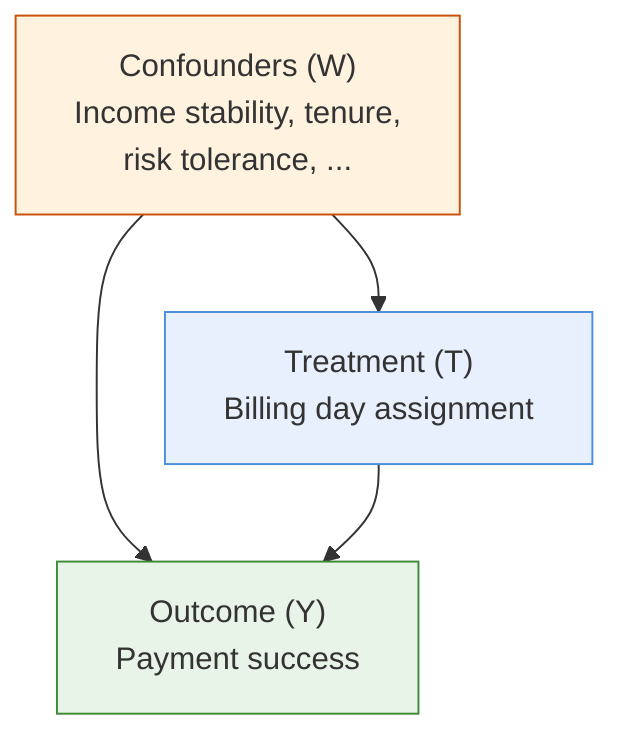
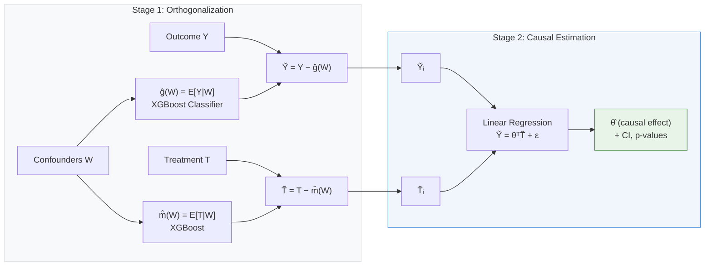

## Problem Statement

A large insurance company collects monthly premiums from a large portfolio of policies. Some payments fail. The business requires answers to two fundamentally different questions: *which* payments are likely to fail (prediction), and *what can be changed* to prevent failure (causal inference).

These demand distinct statistical frameworks. Prediction requires discriminative modeling — ranking policies by failure risk. Causal inference requires isolating the effect of an intervention (e.g., changing the billing day) from the confounding structure that generated the observational data. I built both.

## AI-Orchestrated Development

This project ran on Databricks (Spark SQL + PySpark). Development followed a two-phase AI workflow:

**Phase 1 — Architecture Design with Gemini.** The core technical debate concerned endogeneity: billing day assignment is non-random — it correlates with customer characteristics that also affect payment success. A naive regression comparing success rates across billing days confuses correlation with causation. Through iterative discussion, I converged on EconML's LinearDML framework for causal estimation and a two-stage residual ensemble for prediction.

**Phase 2 — Code Generation with Claude Code.** Each model component had a dedicated `.md` prompt file specifying the exact feature engineering logic, data leakage boundaries, and output schema. Claude Code read these specifications alongside the table metadata and generated the PySpark/SQL pipelines — feature engineering scripts exceeding 1,000 lines, training pipelines with time-based out-of-sample validation, and causal inference workflows with dynamic treatment processing. The specification-driven approach ensured that generated code matched the mathematical blueprint precisely.

## Predictive Model: Two-Stage Residual Learning

### Target Definition

The target variable uses a net-score approach that aggregates multiple transaction records per policy-month:

$$
\text{NetScore}_i = \sum_{j} \mathbb{1}[\text{status}_j = \text{success}] - \sum_{j} \mathbb{1}[\text{status}_j = \text{reversal}]
$$

A policy-month is labeled as successful ($y = 1$) if $\text{NetScore} \geq 1$.

### Handling Class Imbalance

Payment success rates in billing data are not balanced — the majority of policy-months succeed, making the failure class the minority of interest. The model uses cost-sensitive instance weighting rather than resampling:

$$
w_i = \begin{cases}
n_- / n_+ & \text{if } y_i = 1 \\
1.0 & \text{if } y_i = 0
\end{cases}
$$

This scales each observation's contribution to the loss gradient by the inverse frequency of its class. The weighting is computed dynamically per training period and applied to both the logistic regression base and the XGBoost residual model. By operating on the loss function rather than the data, cost-sensitive weighting preserves the original feature distribution and produces better-calibrated probability estimates than synthetic oversampling.

### Objective Function — Stage 1: Logistic Regression (Base Model)

The base model minimizes the $\ell_2$-regularized negative log-likelihood with class-weighted instances:

$$
\mathcal{L}_{\text{base}}(\mathbf{w}, b) = -\frac{1}{N}\sum_{i=1}^{N} w_i \Big[ y_i \log \hat{p}_i + (1 - y_i) \log(1 - \hat{p}_i) \Big] + \lambda \Big[\alpha \|\mathbf{w}\|_1 + (1 - \alpha) \|\mathbf{w}\|_2^2 \Big]
$$

where $\hat{p}_i = \sigma(\mathbf{w}^\top \mathbf{x}_i + b)$, $w_i$ is the class weight ($w_+ = n_- / n_+$ for positive instances), and $(\lambda, \alpha)$ are selected via grid search over $\lambda \in \{0.001, 0.01, 0.1\}$ and $\alpha \in \{0.0, 0.5, 1.0\}$.

### Objective Function — Stage 2: GBT Regressor (Residual Model)

Define the residual:

$$
r_i = y_i - \hat{p}_{\text{base},i}
$$

The gradient-boosted tree regressor minimizes the mean squared error on these residuals:

$$
\mathcal{L}_{\text{residual}}(\mathbf{\Theta}) = \frac{1}{N}\sum_{i=1}^{N} \Big(r_i - f_{\text{GBT}}(\mathbf{x}_i; \mathbf{\Theta})\Big)^2
$$

Hyperparameters: `max_depth=5`, `n_estimators=100`, `learning_rate=0.1`, `subsample=0.8`, `colsample_bytree=0.8`. The ensemble prediction:

$$
\hat{y}_{\text{final},i} = \text{clip}\!\Big(\hat{p}_{\text{base},i} + f_{\text{GBT}}(\mathbf{x}_i; \hat{\mathbf{\Theta}}),\; 0,\; 1\Big)
$$

### Why Single-Model Ensemble

The billing model uses the full policy population rather than training separate models per segment (e.g., by payment method or premium tier). The rationale:

1. **Sample preservation.** Segmentation fractures the dataset. When a segment contains insufficient observations, the GBT residual stage cannot learn meaningful correction patterns.
2. **Complementary learning.** The logistic regression captures linear effects (premium magnitude, tenure, seasonality). The GBT corrects for non-linear interactions in the residual space — interactions that segment boundaries would either miss or arbitrarily partition.
3. **Empirical performance.** The unified ensemble's discrimination metrics exceeded those of segment-specific models.

### Feature Engineering

Over 80 features across 8 groups, all computed from the prior month-end snapshot (strict temporal consistency):

**Payment Instrument Characteristics** — transfer type classification (bank transfer, card, giro), financial institution encoding, instrument validity indicators, card expiration proximity risk flags (high / medium / low / no expiry)

**Behavioral Delay Distributions** — rolling 6-month payment delay statistics (mean, maximum, count exceeding a 5-day threshold), method-change signals, historical delinquency rates at 6-month and full-history horizons, reinstatement history indicators

**Bundle Billing Risk** — co-billed policy counts, premium concentration ratios, bundle-level historical failure rates, endorsement intensity (none / low / medium / high), premium concentration classification (single / concentrated / distributed)

**Contract Maturity Profile** — tenure segments (initial / early / mid / long-term), premium burden tiers (low through very high), premium growth rate, premium shock flags (month-over-month changes $\geq 10\%$ and $\geq 20\%$), auto-renewal indicators

> **Margin note:**
> Cyclic encoding avoids the discontinuity problem: without it, month 12 and month 1 appear maximally distant despite being adjacent. The $\sin$/$\cos$ representation maps the 12 months onto a unit circle, preserving circular proximity.

**Seasonality and Timing** — billing day position (early / mid / late month), proximity to common salary disbursement dates, holiday flags (lunar new year, harvest festival), cyclic month encoding:

$$
\text{month\_sin} = \sin\!\Big(\frac{2\pi m}{12}\Big), \quad \text{month\_cos} = \cos\!\Big(\frac{2\pi m}{12}\Big)
$$

**Historical Aggregate Performance** — customer-level billing experience depth, cumulative success rates, financial institution stability scores, acquisition channel risk tiers (based on historical channel-level success rates)

**Contract Lifecycle** — paid-count-to-tenure ratio (values $< 0.9$ indicate past non-payment episodes), remaining installment count, maturity proximity flags, past-maturity indicators

**Policyholder Demographics** — age cohort, gender, regional code, insured count

### Validation

Time-based OOS split: 70% of available months for training (minimum 6 months), 30% for testing. An explicit 80/20 sub-split within training provides a validation set for hyperparameter selection. Evaluation via AUC, KS, Gini, and decile lift analysis.

## Causal Model: Double Machine Learning

### The Endogeneity Problem

Billing day is not randomly assigned. Customers who selected a salary-aligned billing date may differ systematically — in income stability, financial behavior, or risk tolerance — from those on less common dates. Comparing raw success rates across billing days conflates the treatment effect with selection bias.

A naive regression of payment success on billing day indicators, even with covariates, suffers from regularization bias: the same covariates that confound the treatment also predict the outcome, and regularizing them biases the treatment coefficient. Double Machine Learning addresses this by fully orthogonalizing both the outcome and treatment with respect to confounders before estimating the causal effect.

### LinearDML Framework

> **Margin note:**
> The key insight of DML (Chernozhukov et al., 2018) is that orthogonalization eliminates the regularization bias that afflicts standard penalized regression when confounders are high-dimensional. By using flexible ML models for the nuisance functions $\hat{g}$ and $\hat{m}$, DML achieves $\sqrt{N}$-consistency for $\theta$ even when the nuisance models converge at slower rates.

Define:

- $Y_i \in \{0, 1\}$: payment success
- $T_i \in \mathbb{R}^d$: treatment vector (billing day indicators, payment routing)
- $W_i \in \mathbb{R}^p$: confounder vector

**Stage 1 — Nuisance estimation and orthogonalization:**

$$
\tilde{Y}_i = Y_i - \hat{g}(W_i), \quad \hat{g}(W) = \mathbb{E}[Y \mid W]
$$

$$
\tilde{T}_i = T_i - \hat{m}(W_i), \quad \hat{m}(W) = \mathbb{E}[T \mid W]
$$

Both $\hat{g}$ and $\hat{m}$ are XGBoost models (`max_depth=5`, `n_estimators=100`, `learning_rate=0.1`) trained with 2-fold cross-fitting to avoid overfitting bias. The outcome model $\hat{g}$ uses `XGBClassifier` (binary outcome); the treatment model $\hat{m}$ uses `XGBClassifier` for binary treatments and `XGBRegressor` for continuous treatments, wrapped in a multi-output estimator.

**Stage 2 — Causal estimation:**

$$
\tilde{Y}_i = \boldsymbol{\theta}^\top \tilde{T}_i + \epsilon_i
$$

The vector $\boldsymbol{\theta}$ contains the causal effects, free of confounding under the conditional independence assumption $Y(t) \perp\!\!\!\perp T \mid W$.

### Treatment Variables

The treatments are variables the company can intervene on:

- **Billing schedule** — several possible billing days distributed across the month (early, mid, late), encoded as binary indicators relative to a mid-month reference day
- **Payment instrument routing** — bank transfer vs. card (for the card submodel, further decomposed by card issuer with a reference category)

The model is estimated separately for bank transfer and card payment populations due to structurally different treatment spaces.

### Confounders

30+ confounders organized by type:

- **Continuous:** payment delay statistics, delinquency rates at multiple horizons, reinstatement counts, billing experience depth, success rates, financial institution stability scores, endorsement counts, bundle characteristics, premium growth rates, cyclic time features
- **Binary:** first-payment indicators, tenure stage flags, bundle membership, delinquency history, method-change flags
- **Categorical (one-hot):** tenure category, premium burden level, customer value segment, product line category
- **High-cardinality (label-encoded):** regional code

Log-transformations applied to delinquency counts and premium amounts where appropriate.

### Counterfactual Simulation

Once causal coefficients are estimated, interventions are simulated:

$$
\hat{P}_{\text{counterfactual}}(i) = \text{clip}\!\Big(\hat{P}_{\text{base},i} + \sum_t \hat{\theta}_t \cdot (\text{new}_t - \text{current}_t),\; 0,\; 1\Big)
$$

where $\hat{P}_{\text{base}}$ comes from the predictive model. Each scenario (e.g., shifting billing schedules toward salary-aligned dates) produces an expected uplift with confidence intervals and $p$-values from the LinearDML normal inference.

## The Business Decision

I presented the DML causal model alongside a simpler alternative: a **leaf-based correlation model** — essentially a logistic regression with segment-level reporting, where segments are defined by billing day $\times$ holiday flag ($\times$ card issuer for the card population). Each leaf reports an observed success rate, and "simulation" consists of comparing leaf rates across billing-day segments.

The DML framework was statistically superior:

- It controlled for 30+ confounders via orthogonalization, isolating the causal effect from selection bias
- It produced valid confidence intervals under conditional independence
- It enabled counterfactual reasoning — predicting what *would* happen under a billing day change, not what *has been observed* for customers who happen to be on that day

The leaf-based model could not distinguish correlation from causation. Observed billing-day success rate differences may reflect customer self-selection (customers with stable income choose salary-aligned dates) rather than any causal effect of the billing date itself. Effect estimates from the leaf model are likely upward-biased.

The business chose the leaf-based model. The decision was driven by familiarity: a segment-level summary table mapped directly to how executives already conceptualized the problem. A coefficient vector with confidence intervals and $p$-values did not.

I documented the statistical risks in the model handoff: omitted variable bias from uncontrolled confounders, inflated effect estimates from selection bias, and the impossibility of valid counterfactual reasoning without orthogonalization. These concerns were acknowledged and accepted as known limitations.

This reflects a recurring tension in applied modeling. The most rigorous model is not always the one that ships. The right deliverable is the one the organization can operationalize — even when a more principled alternative exists.

## Technical Stack

| Layer | Technology |
|-------|-----------|
| Data Platform | Databricks, Delta Lake |
| Feature Engineering | PySpark (80+ features, 8+ source tables) |
| Predictive Model | PySpark MLlib (LR) + XGBoost (Two-Stage Residual) |
| Causal Model | EconML LinearDML + XGBoost nuisance models |
| Validation | Time-based OOS, explicit train/validation sub-split |
| Experiment Tracking | MLflow |
| AI Workflow | Gemini (endogeneity analysis, DML design) + Claude Code (code generation) |
