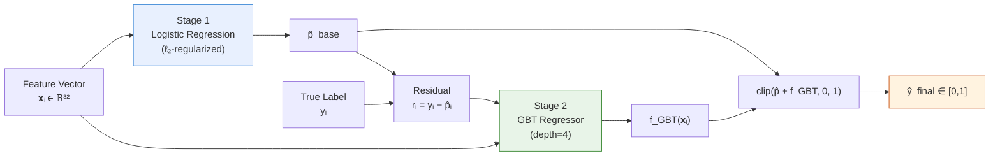

## Problem Statement

An insurance company runs monthly outbound call campaigns targeting existing policyholders. A substantial fraction of calls fail to connect. Each unanswered call represents wasted agent labor and displaced opportunity cost. The objective is to rank customers by contact probability so that agents prioritize the most reachable segment of the list.

The target variable is binary: whether a customer has a meaningful phone conversation ($\geq 60$ seconds) during a given campaign month.

This model serves the same outbound campaign infrastructure as the [[reinstatement-model-imbalanced-classification|reinstatement prediction model]], but targets a different outcome: reachability rather than conversion.

## Feature Engineering

32 features across 10 groups, constructed from campaign logs, policy records, claims history, customer service interactions, and coverage tables. All features are joined on a common customer key and use a strict one-month lag: for campaign month $t$, features reflect data available through month $t-1$.

**Contact Behavioral History** — rolling 12-month successful contact count, campaign exposure frequency, historical time-of-day patterns (AM/PM receptiveness indicators), total call attempt counts

**Policy Portfolio Indicators** — active contract count, aggregate monthly premium, lapsed and cancelled policy counts, months since most recent policy inception

**Channel Affinity Metrics** — premium distribution across acquisition channels, channel-specific contact rate proxies

**Product Composition** — underwriting-flagged contract counts, supplemental insurance prevalence

**Claim Utilization Patterns** — 3-year claim frequency and magnitude indicators, partitioned by product category

**Demographic Characteristics** — gender, age cohort, residential region, payment modality

**Coverage Magnitude** — insured amounts across key coverage types (log-transformed due to heavy right skew spanning several orders of magnitude)

**Customer Service Engagement** — recent inquiry frequency

> **Margin note:**
> The R-F-M framework originates from direct marketing literature (Hughes, 1994). Here, the weights are domain-calibrated: frequency receives the highest weight because multi-policy customers exhibit structurally different contact behavior.

**Value Segmentation** — a composite R-F-M score:

$$
\text{CLTV} = w_R \cdot R_i + w_F \cdot F_i + w_M \cdot M_i
$$

where $R$ is a percentile-ranked tenure measure, $F$ is a dense-rank-normalized active policy count, and $M$ is a percentile-ranked cumulative premium. The weights reflect a frequency-dominant business priority. Customers are discretized into three tiers (High / Mid / Low) based on threshold cutoffs.

**Occupational Contact Propensity** — a categorical contact-level assignment derived from occupation classification mappings

### Preprocessing

Starting from 44 candidate features:

- 5 constant-value columns removed (zero variance across the dataset)
- 2 redundant columns dropped (perfect correlation with existing features)
- Negative values in temporal features (indicating data quality issues) set to null
- $\log(1 + x)$ transformation applied to 7 heavily right-skewed monetary and coverage amount variables (spanning magnitudes of $10^{10}$ to $10^{12}$)

Final feature count after preprocessing: 32.

## Handling Class Imbalance

Contact success rates vary by campaign but typically exhibit moderate imbalance — a non-trivial fraction of the population is unreachable. Rather than resampling (which distorts feature distributions) or SMOTE (which introduces synthetic noise in high-dimensional space), the model uses **cost-sensitive instance weighting**:

$$
w_i = \begin{cases}
n_- / n_+ & \text{if } y_i = 1 \\
1.0 & \text{if } y_i = 0
\end{cases}
$$

where $n_-$ and $n_+$ are the negative and positive class counts in the training set. This weighting enters the loss function directly, scaling each observation's gradient contribution proportionally to the inverse of its class frequency. The effect is equivalent to rebalancing the effective sample without duplicating or synthesizing observations — preserving the original feature distribution while forcing the optimizer to attend equally to both classes.

Both the logistic regression base and the GBT residual model receive these weights through their respective `weightCol` parameters.

## Model Architecture

The two-stage residual learning pipeline:

### Objective Function — Stage 1: Logistic Regression (Base Model)

The base model minimizes the $\ell_2$-regularized negative log-likelihood with instance-level class weights:

$$
\mathcal{L}_{\text{base}}(\mathbf{w}, b) = -\frac{1}{N}\sum_{i=1}^{N} w_i \Big[ y_i \log \hat{p}_i + (1 - y_i) \log(1 - \hat{p}_i) \Big] + \lambda \Big[\alpha \|\mathbf{w}\|_1 + (1 - \alpha) \|\mathbf{w}\|_2^2 \Big]
$$

where $\hat{p}_i = \sigma(\mathbf{w}^\top \mathbf{x}_i + b)$ and $w_i$ is the class weight ($w_+ = n_- / n_+$ for positive instances, $1.0$ for negative). The regularization strength $\lambda$ and elastic net mixing parameter $\alpha$ are selected via 3-fold cross-validation over a grid of $\lambda \in \{0.01, 0.1\}$ and $\alpha \in \{0.0, 0.5\}$.

Three categorical features (contact time-of-day pattern, occupational tier, value segment) pass through `StringIndexer` $\to$ `OneHotEncoder`. All numeric features are standard-scaled prior to fitting.

### Objective Function — Stage 2: Gradient-Boosted Tree Regressor (Residual Model)

Define the residual as the gap between the true label and the base model's predicted probability:

$$
r_i = y_i - \hat{p}_{\text{base},i}
$$

The GBT regressor minimizes the mean squared error on these residuals:

$$
\mathcal{L}_{\text{residual}}(\mathbf{\Theta}) = \frac{1}{N}\sum_{i=1}^{N} \Big(r_i - f_{\text{GBT}}(\mathbf{x}_i; \mathbf{\Theta})\Big)^2
$$

The tree is deliberately shallow (`maxDepth=4`, `maxIter=30`, `stepSize=0.1`) — sufficient to capture non-linear interactions without overfitting to noise.

### Ensemble Combination

$$
\hat{y}_{\text{final},i} = \text{clip}\!\Big(\hat{p}_{\text{base},i} + f_{\text{GBT}}(\mathbf{x}_i; \hat{\mathbf{\Theta}}),\; 0,\; 1\Big)
$$

The residual stage produced a meaningful AUC improvement over the base logistic regression alone, confirming that the linear model systematically under- and over-predicts in regions where non-linear feature interactions dominate.

## Why Single-Model Ensemble Over Segmented Models

The original design considered partitioned segmentation — training separate models for each contact time-of-day segment, occupational tier, or value class. I abandoned this approach for three reasons:

> **Margin note:**
> This design choice reflects a general principle: when $N$ is small relative to model complexity, partitioning hurts more than it helps. The bias introduced by pooling across segments is smaller than the variance introduced by training on fractured subsets.

**Sample preservation.** With only several months of training data, partitioning by segment reduces per-segment sample sizes below the threshold where the GBT residual stage can learn meaningful patterns. The single-model approach uses the full dataset for both stages, preserving statistical power.

**Complementary learning.** The logistic regression captures population-level linear effects (premium magnitude, tenure, seasonality). The GBT then captures non-linear micro-interactions *within the residual space* — interactions that segment boundaries would either miss or arbitrarily split. This division of labor between macro-trends and micro-corrections is more principled than forcing segment-specific models to independently learn both.

**Empirical superiority.** The ensemble's discrimination metrics consistently exceeded those of any individual segment-specific model. Segment variables (time-of-day, occupation tier, value class) proved more informative as *features within a unified model* than as *partitioning criteria for separate models*.

The same single-model-over-segmentation argument applies to the [[billing-model-causal-inference-ml-or|billing collection model]], which uses the identical two-stage architecture on payment success prediction.

## Validation

Time-based out-of-sample split: several months of training data, one holdout month. No random shuffling — this preserves the temporal structure inherent in campaign data.

Validation metrics (AUC, KS, Gini) tracked closely between development and holdout sets, with no evidence of overfitting.

### Decile Analysis

The operational value is in the ranked list. Top-decile contact rates substantially exceeded the population average, and the top 40% of the ranked list captured a disproportionate share of successful contacts. Bottom deciles showed contact rates well below baseline. If the business has limited agent capacity, excluding the lowest-ranked deciles sacrifices few successful contacts while recovering significant call-center throughput.

### Feature Interpretation

The top logistic regression coefficients:

1. **Campaign exposure frequency** (negative): customers targeted in more campaigns exhibit declining contact rates — consistent with contact fatigue in repeated outreach
2. **Active policy count** (positive): customers with larger portfolios are more engaged
3. **Policy recency** (negative): longer time since last policy inception correlates with disengagement
4. **Coverage magnitude** (positive): customers with higher insured amounts are more responsive
5. **Prior contact success** (positive): past reachability predicts future reachability — a strong behavioral signal

The negative coefficient on campaign exposure frequency is the most actionable finding. It provides empirical support for a contact frequency cap to mitigate diminishing returns from repeated targeting.

## AI-Assisted Development

The model specification was designed iteratively with Gemini — specifically debating whether to build segment-specific models or a single global model with segment features included. The single-model approach prevailed for the statistical reasons described above.

Claude Code then generated the full pipeline from `.md` prompt files: a 300+ line Spark SQL feature engineering query joining multiple source tables with time-travel consistency, and the PySpark training script implementing the two-stage ensemble, cross-validation, decile evaluation, and MLflow experiment tracking.

## Technical Stack

| Layer | Technology |
|-------|-----------|
| Data Platform | Databricks, Delta Lake |
| Feature Engineering | Spark SQL (32 features, multi-table joins) |
| Model | PySpark MLlib (LR) + GBT Regressor (Two-Stage Residual) |
| Validation | Time-based holdout, decile lift analysis |
| Experiment Tracking | MLflow |
| AI Workflow | Gemini (architecture design) + Claude Code (pipeline generation) |
