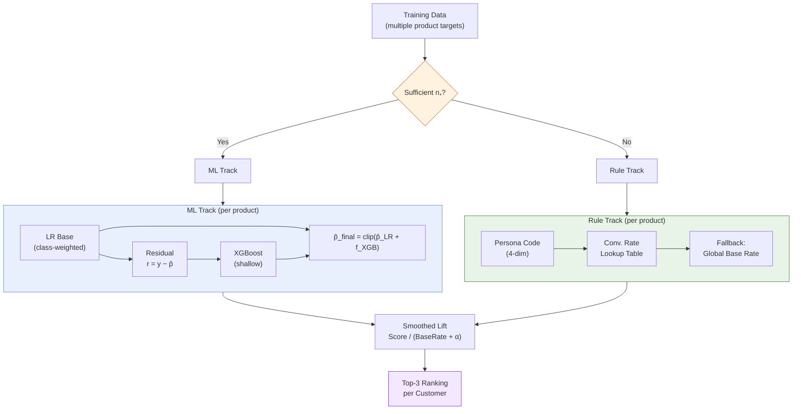

## Problem Statement

An insurance company runs monthly outbound sales campaigns targeting existing policyholders. Agents call customers and recommend products — but which products? Random assignment risks pitching a product the customer already holds, or coverage they purchased last month.

The task: for each customer in a population of hundreds of thousands, rank multiple product groups and recommend the top 3 most likely to convert. The constraint: most product groups have insufficient positive samples for discriminative modeling across the training window. A binary classifier cannot learn meaningful patterns from a handful of positive examples.

## Hybrid Architecture

The solution partitions product groups into two tracks based on training-set positive sample count:

- **ML track** (products with sufficient positive samples): two-stage logistic regression + XGBoost ensemble, trained per product in a one-vs-rest configuration
- **Rule track** (products with insufficient positive samples): persona-based conversion rate lookup tables

Both tracks produce scores on different scales — ML outputs probabilities $\in [0, 1]$, rules output historical conversion rates. A smoothed lift calibration normalizes them for cross-product ranking.

## Persona Generation: The Four-Dimensional Encoding System

Before modeling, customers are clustered into interpretable personas using a four-dimensional encoding.

### K-Means Clustering

Dozens of input features across four categories are standardized and clustered via K-Means:

- **Demographics** — gender, regional economic tier (a multi-level classification based on regional economic indicators), occupation groups, occupational risk grades
- **Life stage** — age-based cohort indicators
- **Behavioral** — payment method ratios (auto-transfer vs. card proportions)
- **Value and loyalty** — active contract counts, product line diversity, tenure metrics, premium aggregates (log-transformed)

$K$ is selected via silhouette analysis. Micro-clusters below 1% of the population are merged into their nearest neighbors.

### Decision Tree Surrogate

A shallow decision tree trained to predict cluster assignments serves as an interpretability layer — translating opaque centroids into human-readable rules that the business can verify and audit.

### The Four-Dimensional Persona Code

Each customer receives a four-character code encoding:

| Dimension | Description |
|-----------|-------------|
| **Occupation** | Hierarchical occupation classification |
| **Life Stage** | Age-based cohort |
| **Geography** | Economic-tier regional classification |
| **Value** | Multi-factor loyalty score |

The **value dimension** uses a 6-factor scoring system:

$$
\text{ValueScore}_i = \sum_{k=1}^{6} \mathbb{1}\big[x_{i,k} \geq \tau_k\big]
$$

where the six factors span contract depth, product diversity, tenure, and premium indicators. The thresholds $\tau_k$ are set at population percentiles. Customers meeting $\geq 4$ conditions are classified as High, 2–3 as Medium, and $< 2$ (with additional contract count thresholds) as Low.

This produces hundreds of unique persona codes. For each persona-product combination, the historical conversion rate on the training set provides the rule-track score.

> [!info] Interactive Element
> This section contained an interactive visualization in the original post.

> [!info] Interactive Element
> This section contained an interactive visualization in the original post.

## Feature Engineering

Over a hundred engineered features derived from a large Spark SQL pipeline joining multiple source tables. All features use a one-month lag relative to the campaign month.

Key feature groups:

- **Portfolio Composition** — product-specific contract counts, purchase recency per product line (with "never purchased" sentinel processing), cumulative premium accumulation per product group (log-transformed)
- **Customer Financial Behavior** — monthly and annual premium aggregates, cumulative paid premium history, payment method ratios, payment stability indicators
- **Demographic and Geographic** — age cohort (with validity flagging for zero values), gender, regional tier, occupational risk grading
- **Churn and Risk** — recent churn flags, lapse counts, delinquency indicators
- **Cross-Sell Signals** — product overlap flags, family coverage indicators, life-stage proxies

### Preprocessing Pipeline

1. **Column deletion** — campaign metadata, sales leakage columns (purchase counts and amounts from the prediction window), constant-value and near-zero-variance features ($\geq 99\%$ zero prevalence)
2. **Time-based split** — test: most recent campaign month; train/validation: prior months, further sub-split for validation with fixed seed
3. **Log-transformation** — all premium and amount features via $\log(1 + x)$
4. **Percentile clipping** — count features capped at 99th percentile
5. **Recency processing** — sentinel values ("never purchased") split into binary `never_purchased` flags plus a capped 120-month recency value
6. **Age imputation** — zero-value ages flagged with a validity indicator and median-imputed
7. **Robust scaling** — tenure and ratio features via $(x - \tilde{x}) / \text{IQR}$
8. **One-hot encoding** — gender, regional tier, occupational risk grade
9. **Target encoding** — high-cardinality fields (occupation code, regional code) with Bayesian smoothing ($\alpha = 100$), computed on the training set only to prevent leakage

## Two-Stage ML Model

For product groups with sufficient positive samples, each trains an independent binary classifier.

### Handling Class Imbalance

Product purchase is a rare event — base rates vary by orders of magnitude across product groups. Each per-product binary classifier applies cost-sensitive instance weighting:

$$
w_i = \begin{cases}
n_- / n_+ & \text{if } y_i = 1 \\
1.0 & \text{if } y_i = 0
\end{cases}
$$

where $n_-$ and $n_+$ are computed per product target on the training set. With extreme imbalance ratios for some products, this weighting is essential — without it, the logistic regression converges to near-zero predictions for the minority class. The weighting is applied only to the Stage 1 logistic regression; the Stage 2 XGBoost operates on residuals (a continuous regression target) where the class imbalance is already absorbed into the residual distribution.

### Stage 1: Logistic Regression (Base Model)

$$
\mathcal{L}_{\text{base}}(\mathbf{w}, b) = -\frac{1}{N}\sum_{i=1}^{N} w_i \Big[ y_i \log \hat{p}_i + (1 - y_i) \log(1 - \hat{p}_i) \Big] + \lambda \|\mathbf{w}\|_2^2
$$

Ridge regularization. Class weights: $w_+ = n_- / n_+$.

### Stage 2: XGBoost Residual Correction

$$
r_i = y_i - \hat{p}_{\text{LR},i}
$$

$$
\hat{p}_{\text{final}} = \text{clip}\!\Big(\hat{p}_{\text{LR}} + f_{\text{XGB}}(\mathbf{x};\, r),\; 0,\; 1\Big)
$$

Standard moderate hyperparameters (shallow trees, conservative learning rate, column/row subsampling, combined $\ell_1 + \ell_2$ regularization).

## Rule-Based Track

For sparse products, the persona code maps to a training-set conversion rate:

$$
\text{Score}(i, k) = \begin{cases}
\text{ConvRate}(\text{persona}_i, k) & \text{if persona observed in training} \\
\bar{y}_k & \text{otherwise}
\end{cases}
$$

where $\bar{y}_k$ is the global base rate for product $k$.

Implementation uses Spark-native `F.create_map` + `.getItem()` — no Python UDFs, avoiding serialization overhead and OOM risk at scale.

## Smoothed Lift Calibration and Ranking

> **Margin note:**
> The smoothing constant $\alpha = 0.01$ acts as a floor on the denominator. Without it, a product with base rate 0.0005 would amplify any non-zero score by $2{,}000\times$, dominating the ranking regardless of actual predictive quality.

Raw scores are not comparable across products with different base rates. A score of 0.05 for a product with base rate 0.001 represents a 50$\times$ lift, while the same score for a product with base rate 0.03 represents $\sim 1.7\times$ lift. Ranking on raw scores would systematically favor high-base-rate products.

Smoothed lift normalizes:

$$
\text{LiftScore}_{i,k} = \frac{\text{Score}_{i,k}}{\bar{y}_k + \alpha}
$$

where $\alpha = 0.01$ prevents instability when $\bar{y}_k$ is small.

## Post-Processing Rules

Three business filters applied before final ranking:

1. **Recent churn filter** — customers who lapsed within a recent window receive all scores zeroed
2. **Product overlap penalty** — customers with existing coverage in a product category receive a discount multiplier on that category's scores
3. **Recent purchase filter** — products purchased within a recent holding period are zeroed

After filtering, products are ranked by lift score and the top 3 selected.

Customers excluded by the churn filter may instead be routed to the [[portfolio/sales-ab-lapsed-customer-reactivation/index|lapsed customer reactivation model]], which adapts the same persona-based architecture for the zero-active-contract population.

## Validation

Per-product evaluation on train, validation, and test splits using AUC, KS, and log-loss. Cross-split comparison monitors overfitting: most products generalize with modest degradation from train to test. The time-based test split (most recent campaign month) prevents temporal leakage.

## AI-Assisted Development

Gemini helped design the value dimension scoring — specifically the 6-condition threshold approach vs. a continuous score, choosing discrete conditions for business interpretability. Claude Code generated four scripts from `.md` specifications:

1. **Preprocessing** — log transforms, scaling, encoding, recency processing
2. **Persona generation** — K-Means + silhouette analysis + micro-cluster merging + decision tree surrogate + four-dimensional code assignment
3. **Training** — per-product two-stage ensemble + rule-target conversion rate computation + MLflow logging
4. **Inference** — model restoration, scoring, lift calibration, post-processing, top-3 ranking

## Technical Stack

| Layer | Technology |
|-------|-----------|
| Data Platform | Databricks, Delta Lake |
| Feature Engineering | Spark SQL (over a hundred features, multiple source tables) |
| Clustering | K-Means + Decision Tree Surrogate |
| ML Models | PySpark MLlib LR + SparkXGBRegressor (per-product OvR) |
| Rule Models | Persona-code conversion rate lookup (Spark-native) |
| Calibration | Smoothed Lift ($\alpha = 0.01$) |
| Experiment Tracking | MLflow (models, metadata, persona rules) |
| AI Workflow | Gemini (persona design) + Claude Code (4 pipeline scripts) |
